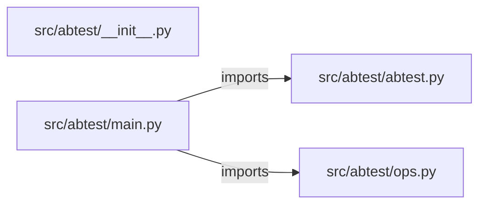

# ab-testing-platform — project architecture

[README](README.md) · [Interview questions and answers](INTERVIEW_QA.md)

## Purpose and scope

Compare control and treatment success counts. A |z| above 1.96 names a winner; otherwise none.

This document describes files and symbols in this checkout. Deployment templates and statements in the original overview are distinguished from a verified running environment.

## Component diagram



For Python repositories, arrows show resolved local imports, not network calls or deployment order. Otherwise the diagram is a repository component map; containment arrows do not assert runtime integration.

## Components and responsibilities

| Component | Responsibility |
| --- | --- |
| [`src/abtest/main.py`](src/abtest/main.py) | HTTP handlers: `GET /healthz`, `POST /analyze` |
| [`src/abtest/ops.py`](src/abtest/ops.py) | HTTP handlers: `GET /readyz`, `POST /workspaces`, `GET /workspaces`, `POST /workspaces/{workspace_id}/jobs`, `GET /jobs/{job_id}` |
| [`src/abtest/abtest.py`](src/abtest/abtest.py) | Functions: `rate`, `analyze` |
| [`requirements.txt`](requirements.txt) | Implementation or supporting configuration |
| [`src/abtest/__init__.py`](src/abtest/__init__.py) | Implementation or supporting configuration |
| [`Dockerfile`](Dockerfile) | Container build/service configuration |
| [`Makefile`](Makefile) | Implementation or supporting configuration |
| [`docker-compose.yml`](docker-compose.yml) | Container build/service configuration |
| [`tests/test_ab.py`](tests/test_ab.py) | Executable checks and regression examples |
| [`tests/test_ops.py`](tests/test_ops.py) | Executable checks and regression examples |
| [`.github/workflows/ci.yml`](.github/workflows/ci.yml) | GitHub Actions job definitions |
| [`README.md`](README.md) | Project explanations or operating notes |
| [`docs/ARCHITECTURE.md`](docs/ARCHITECTURE.md) | Project explanations or operating notes |

## Existing design and operating guides

These checked-in guides provide the project’s detailed design, operational context, or deployment view:

- [`docs/ARCHITECTURE.md`](docs/ARCHITECTURE.md).

## Request interface

| Method and path | Handler | Source |
| --- | --- | --- |
| `GET /healthz` | `healthz` | [`src/abtest/main.py`](src/abtest/main.py#L10) |
| `POST /analyze` | `post_analyze` | [`src/abtest/main.py`](src/abtest/main.py#L15) |
| `GET /readyz` | `readyz` | [`src/abtest/ops.py`](src/abtest/ops.py#L44) |
| `POST /workspaces` | `create_workspace` | [`src/abtest/ops.py`](src/abtest/ops.py#L49) |
| `GET /workspaces` | `list_workspaces` | [`src/abtest/ops.py`](src/abtest/ops.py#L66) |
| `POST /workspaces/{workspace_id}/jobs` | `create_job` | [`src/abtest/ops.py`](src/abtest/ops.py#L73) |
| `GET /jobs/{job_id}` | `get_job` | [`src/abtest/ops.py`](src/abtest/ops.py#L96) |
| `POST /jobs/{job_id}/approve` | `approve_job` | [`src/abtest/ops.py`](src/abtest/ops.py#L105) |
| `GET /audit` | `audit` | [`src/abtest/ops.py`](src/abtest/ops.py#L122) |
| `GET /metrics` | `metrics` | [`src/abtest/ops.py`](src/abtest/ops.py#L138) |

The table lists literal route decorators found in the inspected Python modules. Router prefixes and middleware can add behavior; check the linked handler and application setup before calling an endpoint.

## Implementation walkthrough

### `analyze(control_success, control_n, treatment_success, treatment_n)`

Source: [`src/abtest/abtest.py`](src/abtest/abtest.py#L12).

Calls visible in this function: `InputError`, `any`, `isinstance`, `math.sqrt`, `rate`, `round`.

```python
def analyze(control_success, control_n, treatment_success, treatment_n):
    nums = (control_success, control_n, treatment_success, treatment_n)
    if any(not isinstance(v, int) or isinstance(v, bool) or v < 0 for v in nums):
        raise InputError("counts must be non-negative integers")
    if control_n < 1 or treatment_n < 1:
        raise InputError("each arm needs at least one observation")
    if control_success > control_n or treatment_success > treatment_n:
        raise InputError("successes cannot exceed observations")
    p1, p2 = rate(control_success, control_n), rate(treatment_success, treatment_n)
    lift = p2 - p1
    pooled = rate(control_success + treatment_success, control_n + treatment_n)
    se = math.sqrt(pooled * (1 - pooled) * (1 / control_n + 1 / treatment_n)) if 0 < pooled < 1 else 0
    z = lift / se if se else 0
    return {
        "control": round(p1, 4),
        "treatment": round(p2, 4),
        "lift": round(lift, 4),
        "z": round(z, 4),
        "winner": "treatment" if z > 1.96 else "control" if z < -1.96 else "none",
    }
```

### `rate(success, n)`

Source: [`src/abtest/abtest.py`](src/abtest/abtest.py#L8).

```python
def rate(success, n):
    return success / n if n else 0
```

## Validation and failure paths

| Explicit exception | Source |
| --- | --- |
| `InputError('counts must be non-negative integers')` | [`src/abtest/abtest.py`](src/abtest/abtest.py#L15) |
| `InputError('each arm needs at least one observation')` | [`src/abtest/abtest.py`](src/abtest/abtest.py#L17) |
| `InputError('successes cannot exceed observations')` | [`src/abtest/abtest.py`](src/abtest/abtest.py#L19) |
| `HTTPException(status_code=422, detail=str(exc))` | [`src/abtest/main.py`](src/abtest/main.py#L19) |
| `HTTPException(status_code=404, detail='workspace not found')` | [`src/abtest/ops.py`](src/abtest/ops.py#L77) |
| `HTTPException(status_code=404, detail='job not found')` | [`src/abtest/ops.py`](src/abtest/ops.py#L100) |
| `HTTPException(status_code=404, detail='job not found')` | [`src/abtest/ops.py`](src/abtest/ops.py#L109) |
| `HTTPException(status_code=403, detail='production apply is disabled in this lab')` | [`src/abtest/ops.py`](src/abtest/ops.py#L113) |

These are explicit exceptions in the inspected source, rather than a claim that every failure is handled. Follow the calling handler to see whether the exception becomes an HTTP response or propagates.

## Data and state

- [`src/abtest/ops.py`](src/abtest/ops.py) defines module-level containers: `_WORKSPACES`, `_JOBS`, `_AUDIT`, `_METRICS`.

Module-level dictionaries/lists live in a Python process. They can be fixtures or mutable state; inspect writes before treating them as persistent storage. A production extension would need to define persistence and concurrency behavior explicitly.

## Data flow and design decisions

### What is the input-to-output contract of `analyze`

In [`src/abtest/abtest.py`](src/abtest/abtest.py#L12), `analyze(control_success, control_n, treatment_success, treatment_n)` receives the inputs. The function computes these intermediate values:

- `nums = (control_success, control_n, treatment_success, treatment_n)`
- `p1, p2 = (rate(control_success, control_n), rate(treatment_success, treatment_n))`
- `lift = p2 - p1`
- `pooled = rate(control_success + treatment_success, control_n + treatment_n)`
- `se = math.sqrt(pooled * (1 - pooled) * (1 / control_n + 1 / treatment_n)) if 0 < pooled < 1 else 0`
- `z = lift / se if se else 0`

Its result is defined by:

- `{'control': round(p1, 4), 'treatment': round(p2, 4), 'lift': round(lift, 4), 'z': round(z, 4), 'winner': 'treatment' if z > 1.96 else 'control' if z < -1.96 else 'none'}`

### Which decision rules or boundary conditions should an interviewer challenge

The implementation in [`src/abtest/abtest.py`](src/abtest/abtest.py#L12) branches on:

- `any((not isinstance(v, int) or isinstance(v, bool) or v < 0 for v in nums))`
- `control_n < 1 or treatment_n < 1`
- `control_success > control_n or treatment_success > treatment_n`

A useful extension is a table-driven test that covers each condition just below, at, and above its boundary where applicable. These expressions are the current rules; changing them changes behavior and should be justified by the project’s acceptance criteria.

### What does the operations plane add, and where is its limit

[`src/abtest/ops.py`](src/abtest/ops.py) declares `GET /readyz`, `POST /workspaces`, `GET /workspaces`, `POST /workspaces/{workspace_id}/jobs`, `GET /jobs/{job_id}`, `POST /jobs/{job_id}/approve`, `GET /audit`, `GET /metrics`. Inspect the application’s `include_router` call for its URL prefix.

Its state containers are `_WORKSPACES`, `_JOBS`, `_AUDIT`, `_METRICS`. The job-approval handler defines whether a target is accepted or refused; check that branch and the associated tests instead of treating a recorded job as a successful infrastructure apply.

## Setup and verification

The following commands are derived from the checked-in dependency/test contracts. Execute them from the repository root; the block prepares a local environment, not a cloud deployment.

```bash
python3 -m venv .venv
source .venv/bin/activate
python -m pip install -r requirements.txt
python -m pytest -q
```

Python dependencies: [`requirements.txt`](requirements.txt).

Test entry points: [`tests/test_ab.py`](tests/test_ab.py), [`tests/test_ops.py`](tests/test_ops.py).

Automation definitions: [`.github/workflows/ci.yml`](.github/workflows/ci.yml). Read their triggers and job steps to determine what CI actually runs.

## Operating boundaries and design review

Before turning this checkout into a customer deployment, establish the input contract, data ownership, access controls, failure response, evaluation criteria, and rollback owner. Repository fixtures and unit tests demonstrate local behavior; they do not establish throughput, uptime, compliance, or business impact.

A useful architecture review starts with the linked implementation: identify where input enters, where a decision is made, which state can change, and which external dependency can fail. Add a deployment view only for infrastructure that is actually configured and exercised.
